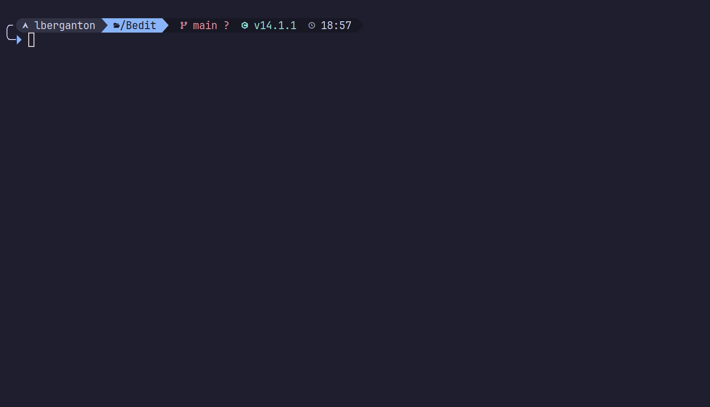

# Bedit

Bedit é um projeto que desenvolvi para fins de estudo pessoal, implementando um editor de texto simples, similar ao Vim, escrito em C usando NCurses.

## Demo



## Funcionalidades

Bedit implementa estas funcionalidades:

- Detecção do formato do arquivo
- O Básico das VI Motions
- Caracteres Unicode
- Undo (Ctrl + Z)
- Auto-pairs
- Auto-tab

Há planos para implementar no futuro:

- Syntax highlighting
- Configurações com arquivos TOML
- Navegação em árvore de diretórios
- Visual Mode (VIM)

NÃO há certeza se estas serão implementadas. Por se tratar de um projeto que fiz para estudos pessoais,
não tenho a menor intenção de mantê-lo. Mas provavelmente irei modificá-lo como desafio.

## Começando

### Abrindo Arquivos

Para abrir um arquivo passe o nome do arquivo como argumento para Bedit:

```text
bedit <arquivo>
```

Se o arquivo existir ele será aberto, se ele não existir, será aberto um novo arquivo em branco.
Para salvar o arquivo, um nome terá de ser fornecido caso não tenha sido passado como argumento.

### Modos

Bedit possui dois modos: `Normal` e `Inserção`.

O modo Normal, serve para se movimentar pelo texto e fazer remoções de caracteres. Já o modo de Inserção,
para inserir caracteres (Quem diria?).

### Atalhos

| Modo     | Teclas        | Ação                                        |
| :------: | :-----------: | :-----------------------------------------: |
| Normal   | h             | Mover cursor para esquerda                  |
| Normal   | j             | Mover cursor para baixo                     |
| Normal   | k             | Mover cursor para cima                      |
| Normal   | l             | Mover cursor para direita                   |
| Normal   | w             | Mover cursor para a próxima palavra         |
| Normal   | b             | Mover cursor para a palavra anterior        |
| Normal   | 0             | Mover cursor para o início da linha         |
| Normal   | $             | Mover cursor para o fim da linha            |
| Normal   | :             | Inserção de comandos                        |
| Normal   | x             | Apagar um caractere                         |
| Normal   | u             | Desfazer ação                               |
| Normal   | i             | Modo Inserção                               |
| Qualquer | Seta Esquerda | Mover cursor para esquerda                  |
| Qualquer | Seta Baixo    | Mover cursor para baixo                     |
| Qualquer | Seta Cima     | Mover cursor para cima                      |
| Qualquer | Seta Direita  | Mover cursor para direita                   |
| Qualquer | HOME          | Mover cursor para o início da linha         |
| Qualquer | END           | Mover cursor para o fim da linha            |
| Qualquer | PAGE UP       | Mover cursor uma página para cima           |
| Qualquer | PAGE DOWN     | Mover cursor uma página para baixo          |
| Qualquer | DELETE        | Apaga um caractere                          |
| Qualquer | ESC           | Modo Normal                                 |
| Qualquer | Ctrl + S      | Salvar arquivo                              |
| Qualquer | Ctrl + Q      | Sair do Bedit                               |

### Comandos

Para inserir um comando pressione `:` no modo Normal.

Comandos disponíveis:

| Comando | Parâmetros                     | Ação                            |
| :-----: | :----------------------------: | :-----------------------------: |
| w       | Nome e caminho do arquivo      | Salvar arquivo                  |  
| q       |                                | Sair do Bedit                   |
| wq      | Nome e caminho do arquivo      | Salvar arquivo e sair do Bedit  |
| q!      |                                | Forçar saída                    |
| debug   |                                | Ativa/Desativa o Debug          |

## Cores

O tema padrão do Bedit foi feito com base nas cores [Catppuccin Mocha](https://catppuccin.com/).

Mas se um dia eu implementar arquivos de configuração TOML, terá uma forma de personalizar as cores.

## Montando Bedit

Dependências:

- GCC
- Make
- NCurses

Para montar o projeto:

```bash
make
```
